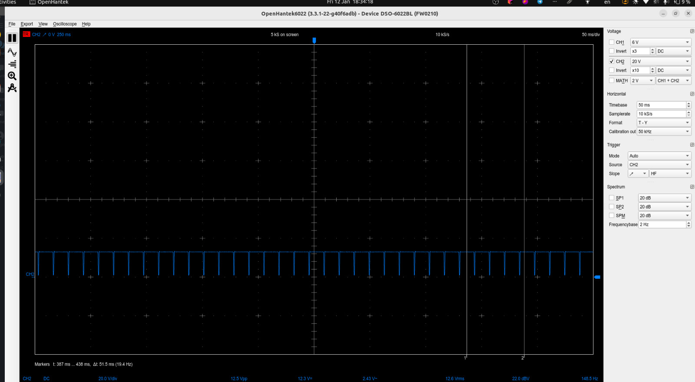
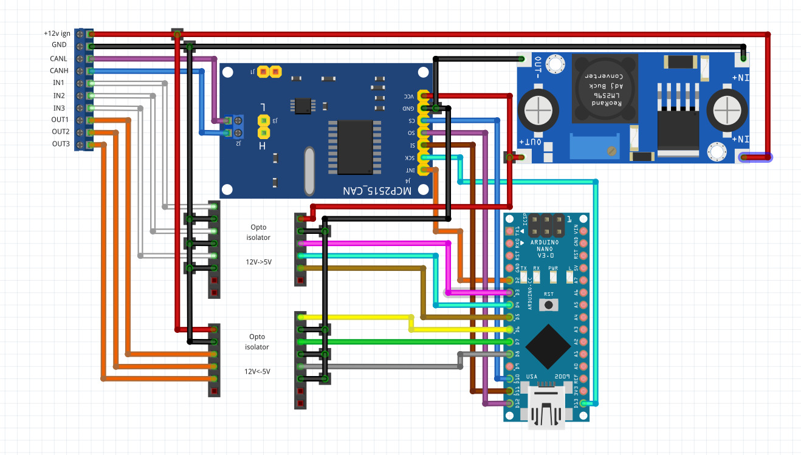

# Ford Focus mk2 2005 - Canbus module

## Status - 
- [x] Convert illumination PWM to 12V trigger (on/off)
- [x] Detect parking brake and reverse gear. Camera turns on when reverse gear is engaged and off when disengaged. Parking brake is used in android auto for keyboard/voice-only input in Google Maps.
- [ ] Find speed and distance travel in the canbus.
- [ ] Add logic for intelligent camera on/off.
- [ ] Implement auto lock function based on speed.

## Description
<!--  -->
This project started after I upgraded my CD6000 ford focus radio to the Pioneer SPH-DA360DAB head unit.

The goal is two fold:
1. Solve the problem with the illumination
2. Make the reverse camera switching better.

### The problem with the illumination
After finishing the installation, there was a problem where the radio couldn't properly detect that the lights of the car were on or off. Instead, the screen was switching frantically between day and night mode. The radio is expecting to read a 12v signal in the "illumination" wire that indicates that the lights of the car or the dashboard are on. In some radios, that means that they should turn on the button lights or dim the lights and so goes on. (pin 14 in the ford quadlock connector)

After hooking up a osciloscope in the illumination wire on pin 14 it was discovered that the signal was actually a PWM signal used to dim the lights of the previous radio (Ford CD6000).

The car has a potentiometer controlling this pwm on the light switch panel.

Part of this projects provides a pwm reader that converts the signal to a 12v on/off output, so that the pioneer can work properly.

### The reverse camera switching
I had recently installed a reverse camera in my car that was wired on the reverse lights. When the reverse gear was engaged, the camera would turn on and also send 12v power to the head unit. The head unit has one wire that works as a trigger and expects the reverse input detect.

This setup is a very classic setup and it works well. However, I wanted to implement a more modern approach found in newer vehicles.

The goal is that when the car engages reverse, the camera turns on. Even if the car exists the reverse gear the camera still remains on. This is helpful when the driver is doing parallel parking and is switching quickly between reverse and 1st gear. To prevent the camera from switching on/off all the time the following logic is implemented.

1. Driver engages reverse gear
2. Camera turns on
3. Turn off the camera only when this two conditions are met.

Conditions:
* The car reaches 20km/h while reverse is NOT engaged
* The car does more than 20 meters while the reverse is NOT engaged

## Schematics
Components:
- Arduino Nano
- MCP2515 CanBus module
- 12V to 5V converter
- PC817 Optocoupler 12V -> 5V
- PC817 Optocoupler 5V -> 12V

The following graph shows the connections.

Actual module:

> NOTE: I used a arduino nano with usb c for convenience. But the picture is different in fritzing.

## Requirements
- mcp2515 library for interfacing with the canbus module. You can find it here: https://github.com/coryjfowler/MCP_CAN_lib
